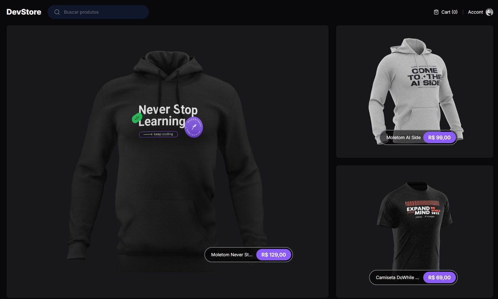

# 🛒 Ecommerce Next

Um projeto **educacional** desenvolvido com o intuito de aprofundar conhecimentos em **Next.js 15**, explorando conceitos modernos como **SSR (Server-Side Rendering)** e **BFF (Backend for Frontend)**.  
O **Ecommerce Next** simula uma loja online completa, com funcionalidades essenciais de um e-commerce, utilizando tecnologias atuais e boas práticas de desenvolvimento front-end.

---

## 🚀 Tecnologias Utilizadas

- **Next.js 15** — Framework React com foco em performance e renderização híbrida (SSR/SSG).  
- **TypeScript** — Tipagem estática para maior segurança e legibilidade do código.  
- **Tailwind CSS** — Framework de estilização utilitária para criação rápida de interfaces responsivas.  
- **Lucide React** — Biblioteca de ícones simples e moderna, usada para melhorar a UI.  
- **Cypress** — Ferramenta de testes end-to-end utilizada para garantir a confiabilidade das principais funcionalidades.

---

## ⚙️ Funcionalidades

- 🔍 **Busca de produtos:** Filtra e exibe os produtos conforme o termo digitado na barra de pesquisa.  
- 🛍️ **Carrinho de compras:** Permite adicionar e visualizar itens selecionados.  
- 👀 **Pré-visualização de produto:** Abre uma página específica para exibir detalhes do item escolhido.  
- 🧭 **Navegação dinâmica:** Implementação de rotas com e sem parâmetros, explorando a estrutura de páginas e pastas do Next.

---

## 🧠 Conceitos Estudados

Durante o desenvolvimento deste projeto, foram estudados e aplicados diversos conceitos fundamentais do ecossistema **Next.js** e **Node.js**, como:

- **SSR (Server-Side Rendering):** Renderização de páginas no servidor para melhor SEO e performance.  
- **BFF (Backend For Frontend):** Camada intermediária entre o front e o back para otimização de dados e desempenho.  
- **Estrutura de pastas do Next.js 15:** Uso de `layout`, `page`, `loading` e `[]` para criação de rotas dinâmicas e estáticas.  
- **Renderização condicional e reatividade com hooks do React.**  
- **Componentização e boas práticas de UI/UX com Tailwind.**

---
